# Interactive Acute Diagram Generator

Create an acute diagram for an n-gon interactively. All but one of the main arcs can have fixed direction.

For the definition of _acute diagrams_, see [Yaroslav Shitov, Sublinear extensions of polygons, 2020](https://arxiv.org/abs/1412.0728v2).
